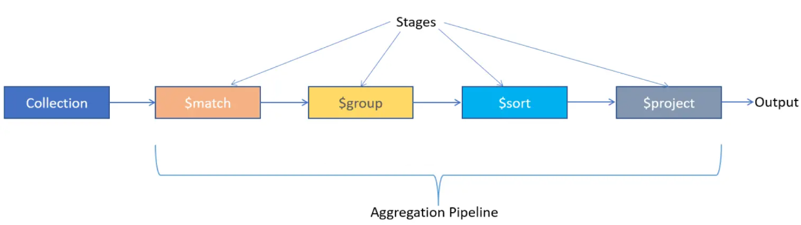

# MongoDB Aggregation

    

### Aggregation Explained

In MongoDB, aggregation refers to a powerful framework that allows you to process and analyze data within the database using various operations and stages. It enables you to perform complex data transformations, aggregations, and computations to derive meaningful insights from your data.

The aggregation framework in MongoDB consists of a pipeline, which is a sequence of stages that data passes through. Each stage performs a specific operation on the data and produces an intermediate result that serves as the input for the next stage. By chaining multiple stages together, you can create sophisticated data processing workflows.

Here are some key components and concepts in the MongoDB aggregation framework:

- <b>Stages: </b>Each stage in the aggregation pipeline performs a specific operation on the data. Some common stages include $match (filters documents), $group (groups documents based on specified criteria), $sort (sorts documents), $project (reshapes or transforms documents), and many more.
- <b>Operators: </b>MongoDB provides a rich set of operators that you can use within aggregation stages to perform various computations, comparisons, transformations, and aggregations. For example, $sum, $avg, $count, $max, $min, $addToSet, $push, $concat, $regexMatch, and so on.
- <b>Expressions: </b>Aggregation expressions are used to specify calculations and transformations within stages. They can include operators, field references, literals, variables, and more. Expressions allow you to perform complex computations and data manipulations during the aggregation process.
- <b>Aggregation Pipeline: </b>The aggregation pipeline is a sequence of stages arranged in a specific order. Each stage operates on the documents received from the previous stage, transforming and reshaping the data until the desired result is achieved.
- <b>Aggregation Methods: </b>MongoDB provides methods and functions, such as **aggregate()**, that allow you to execute aggregation pipelines and retrieve the aggregated results. These methods can be used in the MongoDB shell, programming languages, or MongoDB client libraries.

With the aggregation framework, we can perform a wide range of operations like filtering, grouping, sorting, projecting, joining, and statistical computations on your MongoDB data. It offers a flexible and efficient way to analyze and extract valuable information from your datasets directly within the database.

